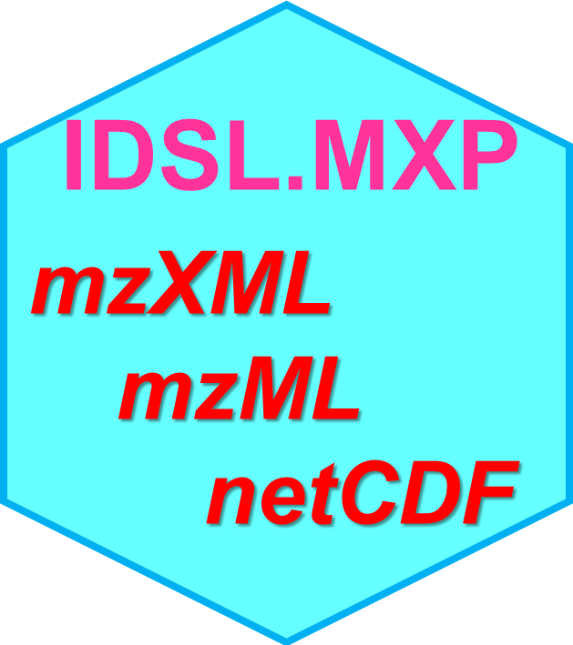

# IDSL.MXP 

<!-- badges: start -->

<!-- badges: end -->

[**Mass Spectrometry Parser (MXP)**](https://ipa.idsl.me/mxp) by the [**Integrated Data Science Laboratory for Metabolomics and Exposomics (IDSL.ME)**](https://www.idsl.me/) is a tiny parser to extract mass spectra data and metadata table of instrumentational acquisition properties from mzML, mzXML and netCDF mass spectrometry files.

	install.packages("IDSL.MXP")
	
**Note:** In case you want to process **netCDF/CDF** mass spectrometry data by IDSL.MXP, you should also install the [**RnetCDF**](https://CRAN.R-project.org/package=RNetCDF) package separately using the below command.

	install.packages("RNetCDF")

## Workflow
To use this package, follow below commands:

	path <- “location address of the mass spectrometry file”
	MSfileName <- "name of the mass spectrometry file with its extension"
	mxpObject <- IDSL.MXP::peak2list(path, MSfileName)

**msobject** is a list with two objects - **1) scanTable**, a data.frame of different scan properties, and **2) spectraList**, a list of m/z and intensity values for each scan.

Visit [**wiki**](https://github.com/idslme/IDSL.MXP/wiki/Example-for-IDSL.MXP) and [Google colab](https://colab.research.google.com/drive/1gXwwuI1zzDHykKfodLSQQt5rwTuFEMpD) to illustrate performance of IDSL.MXP.

## Citation

Fakouri Baygi, S., Kumar, Y. Barupal, D.K. [IDSL. IPA characterizes the organic chemical space in untargeted LC/HRMS datasets](https://pubs.acs.org/doi/10.1021/acs.jproteome.2c00120). *Journal of proteome research*, **2022**, *21(6)*, 1485-1494.